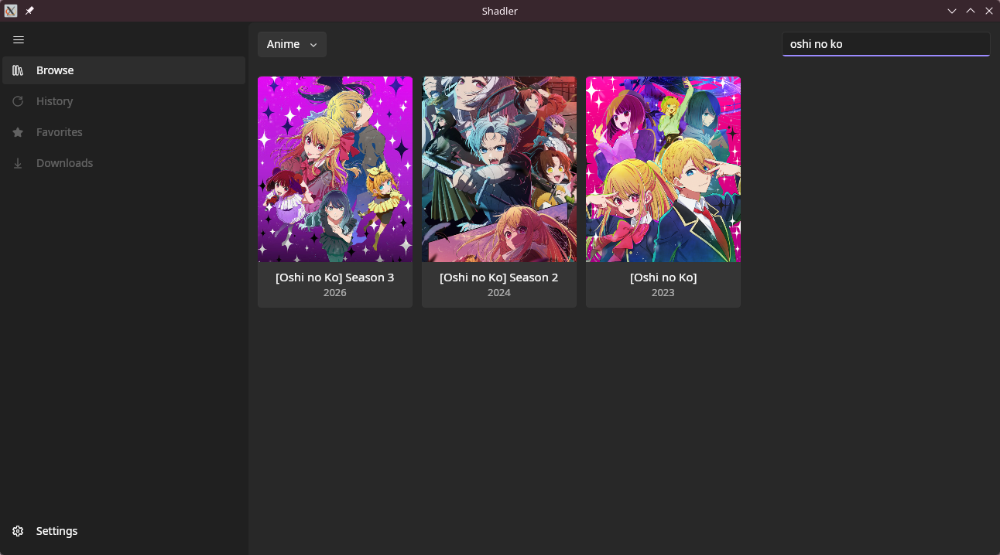
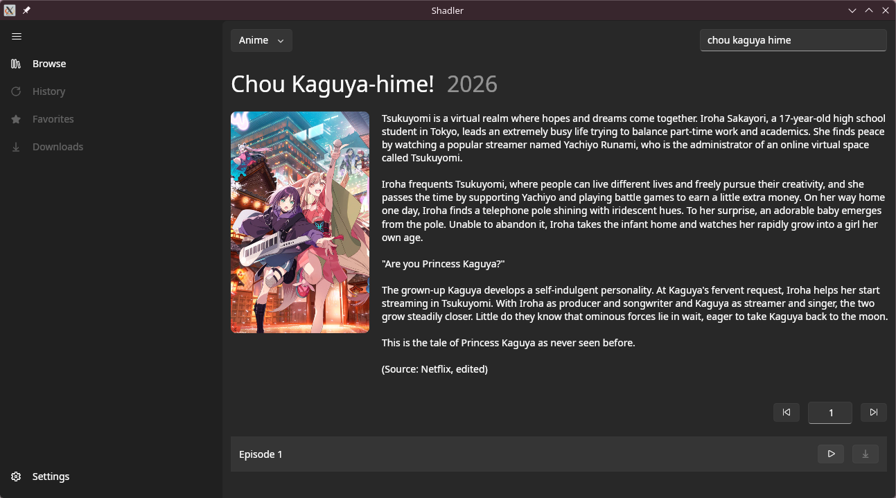

# Shadler (AvaloniaUI
Now *this*, is the definitive version of shadler.

### Backgrounds
I want this version of shadler to be the version that pretty much everyone can use. Either you're a terminal or desktop user, Linux or Windows user, the experience will stay the same. I also want this to be the final form of my project that has existed for 3 years. After this is done, i may start a new development again but on Android, but that is unlikely.

### Difference with WinUI
Almost nothing, as this is a direct port. However, it has performance and UI improvements not available in the WinUI version. shadler-winui is now not on priority list and may get scrapped in the future in favor of this version.

### Supported Versions
- Linux
- Windows 10 (and above)
- Windows 8??

### Screenshot (WIP)

### NOTE
This project is very early in development and may contain bugs, glitches, and memory leaks that can cause the program to exit without warnings.
